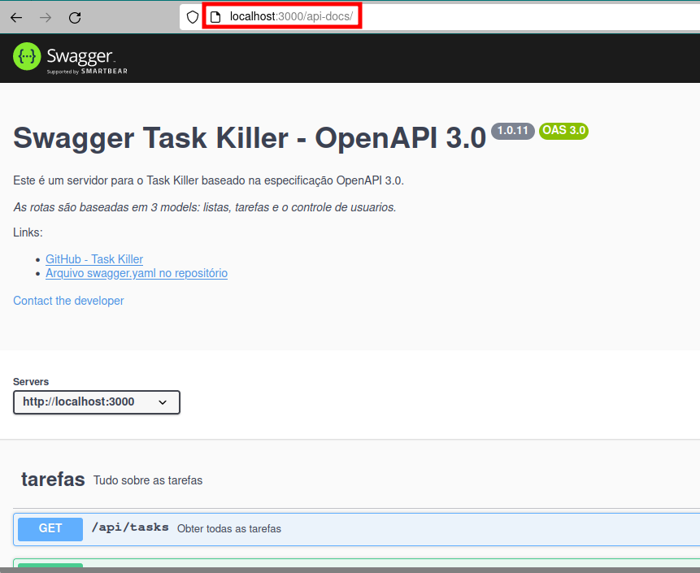

# Task Killer

**Uma To-Do List que simplifica sua vida: leve, fácil e eficiente. Organize suas tarefas com elegância, sem complicações.**

*Trabalho de conclusão de curso - Pós-Graduação em Desenvolvimento Full Stack (PUCRS)*

---
## Backend
***Tecnologias utilizadas:***
* Nodejs
* Express
* MongoDB
* Json Web Token (JWT)
* Mocha, Chai e Supertest (Unit Tests)

***Documentação da API:***

Para ver a documentação da API é só acessar o endpoint **/api-docs** que o arquivo swagger.yml será mostrado localmente no padrão do Swagger Editor.



Se não estiver com o projeto, rodando pode fazer o upload do arquivo [swagger.yml](backend/swagger.yml) em [editor.swagger.io](https://editor.swagger.io/)


***Rodando a aplicação:***
1. Clone o repositório:

```bash
git clone https://github.com/vghessel/taskKiller.git
```

```bash
cd taskKiller
```

2. Instale as dependências:

```bash
cd backend && npm install
```

3. Crie e configure suas credenciais do MongoDB Atlas no arquivo backend/.env:

<sub>Neste caso é necessário ter acesso ao MongoDB Atlas que é um Cluster gratuíto na Cloud do MongoDB</sub>

```bash
MONGODB_URI=mongodb+srv://<username>:<password>@cluster7.tjnxkvv.mongodb.net/?retryWrites=true&w=majority
```

4. Inicialize o servidor:

```bash
cd backend && npm start
```

***Testando a aplicação:***

<sub>**Teste manual:**</sub>

Além de testar utilizando o Postman em conjunto com a documentação Swagger, é possível utilizar o arquivo request.rest com a extensao REST Client no VSCode para fazer as requisições ao banco de dados.

<sub>**Testes unitários:**</sub>

Mocha, Chai e Supertest serão responsáveis por esses testes, para isso rode:

```bash
npm test
```

---
## Frontend

***Tecnologias utilizadas:***
* JavaScript
* React
* Redux
* Iodash
* Material UI


***Rodando a aplicação:***
1. Clone o repositório:

```bash
git clone https://github.com/vghessel/taskKiller.git
```

2. Instale as dependências:
    

3. Inicialize o servidor:

